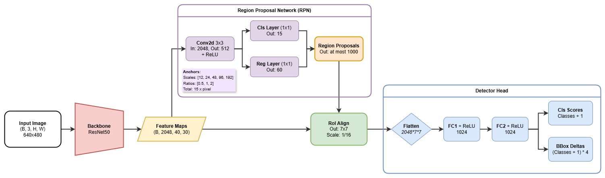

# Faster R-CNN for Small Fruit Detection (Olives & Strawberries)

## Overview
This is a custom implementation of **Faster R-CNN** optimized for the detection and classification of small agricultural objects, specifically Olives and Strawberries. The project was made to solve the [Object Detection Challenge for the Deep Learning and Robot Perception course (2025/2026)](https://isar.unipg.it/challenges/). The dataset and evaluation metrics (metrics.py) are used as provided in the challenge guidelines.

## Key Features
The Backbone is a modified ResNet-50 architecture that preserves spatial resolution. I reduced the stride of the final residual block (Layer 4) from 2 to 1, and added dilated convolutions to maintain the receptive field without downsampling.

The Region Proposal Network (RPN) utilizes 15 anchors per location, specifically scaled for small objects (Scales: 12, 24, 48, 96, 192) to match the statistical properties of small fruits.

The model was optimized using a combination of Cross-Entropy (classification) and Smooth L1 Loss (regression) for both the RPN and the Detector.

## Architecture
This is a general overview of the architecture



## Project Structure
```text
.
├── img/ 
├── data/                   # Dataset folder (see Data Setup below)
├── model/
│   ├── anchor.py           # Custom anchor generator
│   ├── backbone.py         # Modified ResNet-50
│   ├── detector.py         # Fast R-CNN detector head
│   ├── loss.py             # Multi-task loss implementation
│   ├── model.py            # Main FasterRCNN class
│   ├── roi_layer.py        # RoI Align layer
│   └── rpn.py              # Region Proposal Network
├── dataset.py              # Custom loader
├── main.py                 # Training and Testing entry point
├── metrics.py              # IoU and mIoU calculation tools
└── README.md
```

## Data Setup
The project expects a specific directory structure for the dataset dictated by the challenge. You can find the ready-to-go dataset in the challenge url, otherwise ensure your data is organized as follows inside the data/ directory:
```text
data/
├── TRAIN/
│   ├── IMAGES/
│   │   ├── G1/
│   │   ├── G2/
│   │   └── G3/
│   └── LABELS/
│       ├── G1/
│       ├── G2/
│       └── G3/
├── VAL/
│   ├── IMAGES/ ...
│   └── LABELS/ ...
└── TEST/
    └── IMAGES/ ...
    └── LABELS/ ...
```

## Usage
### Training
To train the model from scratch (or optionally resume from a checkpoint) use

```python main.py --mode train --checkpoint checkpoints/faster_rcnn_epoch_17.pth```

The checkpoints are saved automatically to the checkpoints/ folder

### Inference
To generate predictions on the Test set use

```python main.py --mode test --checkpoint checkpoints/faster_rcnn_epoch_17.pth```

The predictions will be saved as .txt files in the data/TEST/labels/ directory.